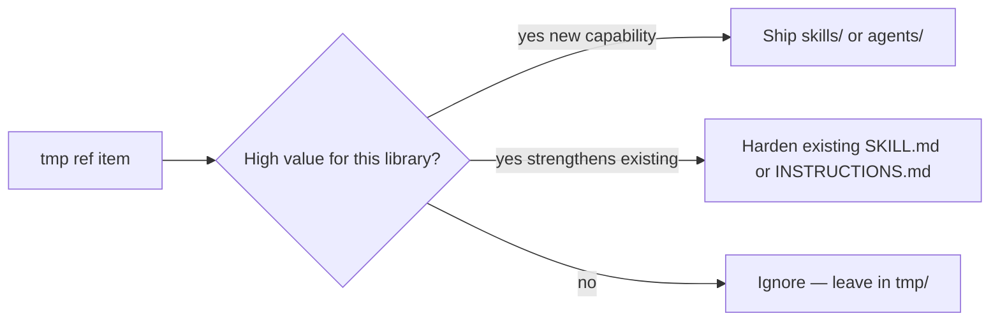

# Absorb Reference Materials (architect-library)

Use this skill when working **in this repository** and the user points at new reference material under `tmp/` (commonly `tmp/skills/` from another author) and asks to review, absorb, merge, or plan adoption.

**This skill is not in `SKILL_BUNDLE`.** It governs maintainers editing the library — not end-user installs.

## Library identity (negotiated scope)

Architect Library **distributes**:

| Type | Purpose |
|------|---------|
| **Skills** | Architecture **artifacts** — Excalidraw, Word, PPT, XLSX, PDF |
| **Agents** | Focused readonly tasks — e.g. `code-review` |

Ref bundles (e.g. Superpowers-style dev workflow) are **input**, not automatic imports. Most items are generic dev discipline or orchestration — **low marginal value** unless they directly strengthen artifact delivery or the existing review agent.

## The three outcomes (only these)

Every ref item gets exactly one outcome:

| Outcome | When | Where it goes |
|---------|------|----------------|
| **Ship** | High value; warrants a **new** install target users need globally | `skills/<name>/` or `agents/<name>/` + `SKILL_BUNDLE` / `AGENT_BUNDLE` |
| **Harden** | Useful patterns but redundant as a separate install | Merge into existing `skills/*/SKILL.md` or `agents/*/INSTRUCTIONS.md` |
| **Ignore** | Low value, generic dev workflow, meta-authoring, orchestration-only, or needs a chain we do not ship | Leave in `tmp/`; do not import |

### What does NOT count as absorption

Do **not** create standalone docs to hold ref content (`SKILL-AUTHORING.md`, workflow playbooks, absorption backlogs, etc.).

**Allowed doc updates** (shipping hygiene only):

- **`README.md` — mandatory after absorb** (see [references/readme-after-absorb.md](references/readme-after-absorb.md)): skills/agents tables, documentation map, repository layout — whenever install surface or user-visible behavior changes
- `docs/AGENT-SKILL-INSTALL.md` — install + execution tables + verify commands (Cursor **and** Copilot paths)
- `docs/CODE-REVIEW-AGENT.md` — when `code-review` behavior changes
- `.cursor/rules/architect-library-execution.mdc` — done-when rows
- `docs/MAINTAINING-SKILLS.md` — checklist pointers only

## Value rubric

Score each ref folder or prompt file:

| Signal | Ship | Harden | Ignore |
|--------|------|--------|--------|
| Fixes artifact “done too early” (file exists ≠ delivered) | ✓ | ✓ inline | |
| Strengthens `code-review` or artifact skills | | ✓ | |
| Generic TDD, debugging, git menus, worktrees | | | ✓ |
| Meta “how to write skills” for maintainers | | | ✓ |
| Orchestration needing a skill chain we do not ship | | | ✓ |
| Second agent overlapping existing `code-review` | | ✓ fold into agent | ✓ if still redundant |
| “How to call reviewer” without new reviewer behavior | | ✓ agent README/INSTRUCTIONS | ✓ as standalone skill |

**Default bias:** when uncertain, **ignore** or **harden** — do not expand global install surface.

### Reference: session triage example (`tmp/skills/` Superpowers)

| Ref | Decision | Reason |
|-----|----------|--------|
| `verification-before-completion` | **Ship** skill | High — evidence before PPT thumbnail / XLSX recalc / delivery claims |
| `code-reviewer.md` | **Harden** `code-review` | SHA scope, strengths, merge verdict |
| `spec-reviewer-prompt.md` (light) | **Harden** `code-review` | Requirements alignment section — not a second agent |
| `requesting-code-review`, `receiving-code-review` | **Ignore** | Caller/etiquette — redundant after stronger agent |
| `systematic-debugging`, `test-driven-development`, `writing-plans` | **Ignore** | Generic dev — outside artifact library |
| `writing-skills`, `using-superpowers`, `brainstorming`, `subagent-driven-development`, etc. | **Ignore** | Meta/orchestration/niche |

## Skill vs agent

| Create **agent** when | Create **skill** when | Neither — harden or ignore |
|-----------------------|----------------------|----------------------------|
| Readonly specialist with dedicated invocation (`/name`) | Discipline gate used across sessions (verification, delivery) | Dispatch scripts, meta-authoring |
| Distinct persona users pick explicitly | Artifact or workflow the main agent follows inline | Overlaps existing agent |

Do **not** add agents to `SKILL_BUNDLE` or skills to `AGENT_BUNDLE`.

## Review workflow

When the user asks to review `tmp/` ref material:

0. **Announce** — `Using absorb-reference-materials to triage tmp/ ref material.`

1. **Inventory** — list folders/files under the ref path (e.g. `tmp/skills/**/SKILL.md`).
2. **Triage** — assign each item: Ship / Harden / Ignore (use rubric above).
3. **Present plan** — table of decisions; user confirms before large imports.
4. **Implement lean** — prefer 0–1 new install targets per review batch unless user expands scope.
5. **Adapt** ref → architect-library:
   - Drop `superpowers:` prefixes; use `REQUIRED SUB-SKILL:` like existing office skills
   - `description` = when-to-use only (not workflow summary)
   - Map tools to Cursor (`Task`, skill `Read` paths); drop alien editor refs
   - Paths: no `docs/superpowers/` — use neutral project paths if needed
   - One-line attribution in shipped `README.md` when license requires
6. **Harden** artifact skills with rationalization tables + `REQUIRED SUB-SKILL: verification-before-completion` when verification skill exists.
7. **Update install hygiene** — `install_library.sh` bundles, `architect-library-patch.mdc`, execution rule, `AGENT-SKILL-INSTALL.md`, `docs/AGENTS.md` / `CODE-REVIEW-AGENT.md` when agents change.
8. **Update README.md** (required after any ship or harden that changes catalog or behavior):
   - Audit per [references/readme-after-absorb.md](references/readme-after-absorb.md)
   - Skills table + custom agents table if applicable
   - Documentation map links for new/changed skills or agents
   - Repository layout tree under `skills/` / `agents/`
   - If `install_library.sh` bundle lists a skill/agent missing from README → add it before closing
   - Ignore-only sessions with zero source edits: note “README unchanged” in your summary
9. **Install scoped to editor** (see below).
10. **Leave ignored ref in `tmp/`** until step 11 — do not delete without user choice.

11. **Close the review — summarize leftovers and ask next step** (required every time):

    After ship/harden work is done and install verified, end with:

    **A. Remaining low-value summary** — list what is still under `tmp/` (paths) and one line each on why it was not absorbed (generic dev workflow, meta-authoring, orchestration-only, redundant with existing agent, etc.). Label this as your maintainer perspective, not a final product decision.

    **B. Ask the user** — present these options:

    > What should we do with the remaining `tmp/` ref material?
    >
    > 1. **Replan** — another absorption pass (you point at specific folders or new criteria)
    > 2. **Clean `tmp/`** — remove ignored ref files/folders from `tmp/`
    > 3. **Keep for now** — leave `tmp/` unchanged as local reference

    Do not delete `tmp/` or start a second absorption pass until the user picks an option. Do not skip this ask because absorption “felt complete.”

## Editor-scoped install (mandatory)

| Session | Command only | Targets |
|---------|----------------|---------|
| **Cursor** | `bash scripts/install_library.sh all cursor` | `~/.cursor/skills/`, `~/.cursor/agents/` |
| **VS Code Copilot** | `bash scripts/install_library.sh all copilot` | `~/.copilot/skills/`, `~/.copilot/agents/` |

- Never run bare `install_library.sh` (all editors) unless the user explicitly asks.
- Never write `~/.copilot/` from a Cursor session or `~/.cursor/` from VS Code.
- Docs must document **both** editor paths; **implementation** uses the active editor only.

After skill/agent source changes in Cursor: `bash scripts/install_library.sh all cursor` from repo root.

## Shipping checklist (new install target only)

Follow [docs/MAINTAINING-SKILLS.md](../../docs/MAINTAINING-SKILLS.md):

- [ ] `skills/<name>/SKILL.md` + `README.md` (or full `agents/<name>/` layout)
- [ ] `SKILL_BUNDLE` or `AGENT_BUNDLE` in `scripts/install_library.sh`
- [ ] `.cursor/rules/architect-library-patch.mdc` bundle string in sync
- [ ] `.cursor/rules/architect-library-execution.mdc` done-when row
- [ ] `docs/AGENT-SKILL-INSTALL.md` (+ `docs/AGENTS.md` / `CODE-REVIEW-AGENT.md` if agent)
- [ ] **`README.md`** — skills/agents table, documentation map, repository layout ([readme-after-absorb.md](references/readme-after-absorb.md))
- [ ] `bash scripts/install_library.sh all cursor` (or `copilot` in VS Code)
- [ ] Verify installed path exists under correct home directory

## Harden-only checklist

- [ ] Patch target `SKILL.md` or `INSTRUCTIONS.md` (and agent `README.md` if invocation/behavior blurb changed)
- [ ] No bundle change unless a new folder was added
- [ ] **`README.md`** — update skills/agents blurb or execution pointer if user-visible behavior changed; else state “README unchanged”
- [ ] `docs/AGENT-SKILL-INSTALL.md` execution row if done-when changed
- [ ] Re-run scoped install if agent assembled files changed

## Post-absorb completion gate

Task is **not** done until:

| Check | Pass when |
|-------|-----------|
| Source shipped/hardened | `skills/` or `agents/` edits committed in working tree |
| Bundles in sync | `install_library.sh` matches `architect-library-patch.mdc` |
| Install docs | `AGENT-SKILL-INSTALL.md` matches execution rules |
| **README audit** | Catalog + layout agree with bundle, or you documented “README unchanged” |
| Editor install | Scoped `install_library.sh` run when distributable files changed |
| Close step | Leftover `tmp/` summary + user chose replan / clean / keep |

## Anti-patterns

| Do not | Why |
|--------|-----|
| Import every ref skill “because it’s well written” | Bloats global install; noise for artifact users |
| Create `docs/` playbooks from ref | This library distributes via `skills/` and `agents/` |
| Add `spec-compliance-review` without review chain | Second agent confusion; fold into `code-review` |
| Install to all editors by default | Violates editor-scoped law |
| Copy `skills/` into `.cursor/skills/` as canonical source | Breaks install model — except **this** maintainer skill |
| Ship skill/agent but skip README | Users and maintainers see stale catalog |
| Update `AGENT-SKILL-INSTALL.md` only | README skills table must stay in sync |

## Load first

- [docs/MAINTAINING-SKILLS.md](../../docs/MAINTAINING-SKILLS.md)
- [docs/AGENT-SKILL-INSTALL.md](../../docs/AGENT-SKILL-INSTALL.md)
- [.cursor/rules/architect-library-repo.mdc](../../rules/architect-library-repo.mdc)
- [references/readme-after-absorb.md](references/readme-after-absorb.md) — README audit after every absorb
- [references/triage-examples.md](references/triage-examples.md) — extended session example
