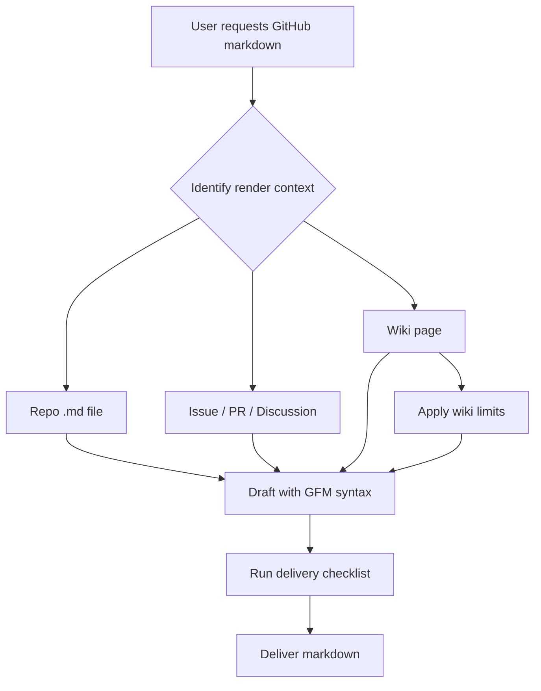

# GitHub Markdown

## Load First

- `references/basic-syntax.md` — headings, emphasis, links, lists, alerts, footnotes
- `references/advanced-formatting.md` — tables, code blocks, diagrams, math, collapsed sections
- `references/context-and-pitfalls.md` — render-context differences, anti-patterns, before/after examples

Official sources: [Basic syntax](https://docs.github.com/en/get-started/writing-on-github/getting-started-with-writing-and-formatting-on-github/basic-writing-and-formatting-syntax) · [Advanced formatting](https://docs.github.com/en/get-started/writing-on-github/working-with-advanced-formatting) · [GFM spec](https://github.github.com/gfm/)

## When to Use

- README, CHANGELOG, CONTRIBUTING, ADR, or any repo `.md` file
- Issue, pull request, or discussion body or comment
- GitHub wiki page
- Release notes or project documentation destined for GitHub rendering

## Workflow

1. **Identify render context** — repo `.md` file, issue/PR/discussion, or wiki (features differ).
2. **Draft** using GFM syntax and the writing rules below.
3. **Consult references/** for syntax you are unsure about.
4. **Run the delivery checklist** before handing off markdown.



## Context Matrix

GitHub does not render all GFM features everywhere. Check before using a feature.

| Feature | `.md` files | Issues / PRs / discussions | Wikis |
|---------|-------------|----------------------------|-------|
| Single-newline line break | Needs two trailing spaces, `\`, or `<br/>` | Auto line break | Same as `.md` |
| Footnotes | Yes | Yes | **No** |
| Issue/PR autolinks (`#123`) | **No** | Yes | **No** |
| Color swatches in backticks | **No** | Yes | Varies |
| Mermaid / diagrams | Yes | Yes | Yes |
| Math (LaTeX) | Yes | Yes | Yes |
| Alerts (`> [!NOTE]`) | Yes | Yes | Yes |
| Task lists | Yes | Yes | Yes |

When in doubt, see `references/context-and-pitfalls.md`.

## Quick Syntax Cheat Sheet

| Element | Syntax | Example |
|---------|--------|---------|
| Heading | `#`–`######` + space | `## Section title` |
| Bold | `**text**` or `__text__` | `**important**` |
| Italic | `*text*` or `_text_` | `_emphasis_` |
| Strikethrough | `~~text~~` | `~~removed~~` |
| Inline code | `` `code` `` | `` `git status` `` |
| Link | `[text](url)` | `[docs](docs/guide.md)` |
| Image | `` | `` |
| Unordered list | `-`, `*`, or `+` | `- item` |
| Ordered list | `1.` | `1. First step` |
| Task list | `- [ ]` / `- [x]` | `- [x] Done` |
| Blockquote | `>` | `> quoted text` |
| Fenced code | ` ```lang ` … ` ``` ` | See advanced reference |
| Alert | `> [!TYPE]` | `> [!WARNING]` |
| Footnote | `[^1]` + `[^1]: text` | See basic reference |
| Horizontal rule | `---` on its own line | `---` |

Alert types: `NOTE`, `TIP`, `IMPORTANT`, `WARNING`, `CAUTION`.

## Writing Rules

### Structure and links

- Keep link text on **one line** — broken link text does not render.
- Use **relative links** for in-repo files (`docs/foo.md`, `../README.md`). Paths starting with `/` are relative to the repo root.
- Do not use clone-breaking absolute GitHub blob URLs when a relative path works.
- Heading anchors: lowercase, spaces → hyphens, punctuation removed; duplicate headings get `-1`, `-2`, etc. Re-check links when headings change.

### Tables and code

- Put a **blank line** before tables and fenced code blocks.
- Escape pipe characters in table cells: `\|`.
- Use alignment colons in the header row (`:---`, `:---:`, `---:`).
- Add a **language tag** on fenced code blocks (` ```python `, ` ```bash `).
- Use **lowercase** language identifiers on GitHub Pages sites.
- Inside lists, indent non-fenced code blocks by **eight spaces**.

### Alerts, task lists, and emphasis

- Use **at most 1–2 alerts** per document; do not place alerts consecutively; do not nest alerts.
- Escape task-list descriptions that start with `(`: `\(Optional)`.
- Use literal Unicode characters, not HTML entities (`&amp;`, `&lt;`) or `§`.

### Diagrams (Mermaid)

- Use camelCase or underscores for node IDs — no spaces (`UserService`, not `User Service`).
- Quote edge labels containing parentheses or special characters.
- Do not use explicit colors or `style`/`classDef` (breaks in dark mode).
- Wrap subgraph labels with special characters in double quotes.

### GitHub-specific content

- `@username` and `@org/team` for mentions (issues/PRs/discussions).
- `#123`, `GH-123`, or `owner/repo#123` for issue/PR references in conversations.
- `:emoji_name:` for emoji (`:rocket:`, `:white_check_mark:`).
- HTML comments `<!-- hidden -->` to hide content from rendered output.

### Do not use on GitHub

- Cursor/IDE code-citation format (` ```start:end:path `) — use standard fenced blocks with a language tag instead.
- Features unsupported in the target context (footnotes in wikis, `#123` autolinks in README files).

## Delivery Checklist

Task is **not** complete until all applicable items pass:

- [ ] Render context identified (`.md` file, issue/PR/discussion, or wiki)
- [ ] Syntax is valid GFM — no generic-markdown-only constructs where GFM is expected
- [ ] Context-limited features avoided (e.g. no footnotes in wikis, no `#123` autolinks in repo `.md` files)
- [ ] In-repo links are relative where applicable
- [ ] Blank lines before tables and fenced code blocks
- [ ] Code fences have language tags when language is known
- [ ] Link text is on a single line
- [ ] Alerts used sparingly (≤2 per document, not consecutive)
- [ ] Mermaid node IDs have no spaces; no hardcoded colors
- [ ] Before/after review: tables render, lists nest correctly, anchors resolve

## Additional Resources

- `references/basic-syntax.md` — full basic GFM reference
- `references/advanced-formatting.md` — tables, code highlighting, diagrams, math, collapsed sections, autolinks
- `references/context-and-pitfalls.md` — common mistakes and worked examples
