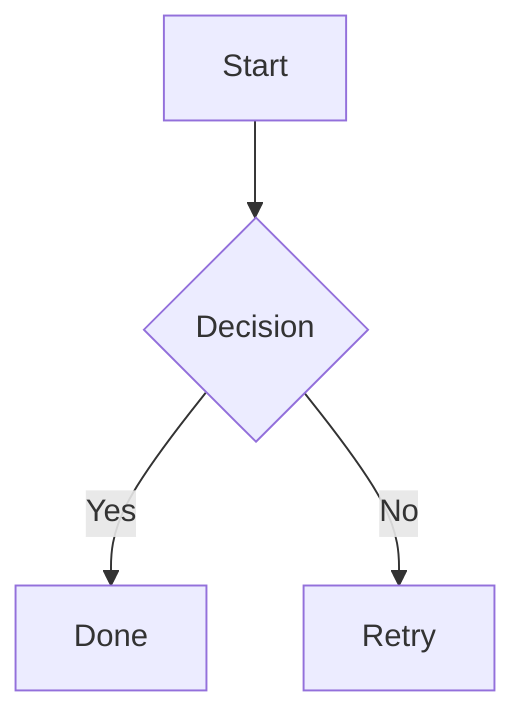

# Advanced GitHub Markdown Formatting

Sources: [Working with advanced formatting](https://docs.github.com/en/get-started/writing-on-github/working-with-advanced-formatting) · [GFM spec](https://github.github.com/gfm/)

## Tables

Blank line required before the table.

```markdown
| Header 1 | Header 2 |
| -------- | -------- |
| Cell 1   | Cell 2   |
| Cell 3   | Cell 4   |
```

Outer pipes are optional. Header row needs at least three hyphens per column. Columns need not align in source.

### Inline formatting in cells

```markdown
| Command | Description |
| --- | --- |
| `git status` | List *new or modified* files |
| `git diff` | Show changes **not staged** |
```

### Column alignment

```markdown
| Left | Center | Right |
| :--- | :---: | ---: |
| text | text   | text  |
```

### Escaping pipes

```markdown
| Name | Character |
| --- | --- |
| Pipe | \| |
| Backtick | ` |
```

## Fenced code blocks

Use triple backticks. Prefer a blank line before and after.

````markdown
```python
def greet(name):
    print(f"Hello, {name}")
```
````

### Showing backticks in a code block

Wrap in quadruple backticks:

`````markdown
````
```
Look! You can see my backticks.
```
````
`````

### Syntax highlighting

Add a language identifier after the opening fence. GitHub uses [Linguist](https://github.com/github-linguist/linguist) for detection.

````markdown
```ruby
require 'json'
puts JSON.generate({ ok: true })
```

```bash
npm install
```

```typescript
const x: string = "hello";
```
````

Use **lowercase** identifiers on GitHub Pages (Jekyll). Valid languages: [linguist languages.yml](https://github.com/github-linguist/linguist/blob/main/lib/linguist/languages.yml).

### Code blocks inside lists

Indent non-fenced code blocks by **eight spaces** to preserve formatting within a list item.

## Diagrams

Supported in issues, PRs, discussions, wikis, and `.md` files via fenced code blocks.

### Mermaid

````markdown

````

Other diagram types: `sequenceDiagram`, `classDiagram`, `stateDiagram`, `erDiagram`, `gantt`, `pie`, etc.

Check Mermaid version on GitHub:

````markdown
```mermaid
info
```
````

### GeoJSON and TopoJSON

````markdown
```geojson
{
  "type": "FeatureCollection",
  "features": []
}
```
````

````markdown
```topojson
{
  "type": "Topology",
  "objects": {}
}
```
````

### STL 3D models

````markdown
```stl
solid cube_corner
  facet normal 0.0 -1.0 0.0
    outer loop
      vertex 0.0 0.0 0.0
    endloop
  endfacet
endsolid
```
````

## Mathematical expressions

Uses MathJax. Available in issues, PRs, discussions, wikis, and `.md` files.

### Inline math

```markdown
Inline with dollars: $\sqrt{3x-1}+(1+x)^2$

Inline with backticks (when $ conflicts with Markdown): $`\sqrt{3x-1}+(1+x)^2`$
```

### Block math

In `.md` files, end the line before `$$` with `\` for a line break, or use a `math` fenced block:

````markdown
**The Cauchy-Schwarz Inequality**\
$$\left( \sum_{k=1}^n a_k b_k \right)^2 \leq \left( \sum_{k=1}^n a_k^2 \right) \left( \sum_{k=1}^n b_k^2 \right)$$

```math
\left( \sum_{k=1}^n a_k b_k \right)^2 \leq \left( \sum_{k=1}^n a_k^2 \right) \left( \sum_{k=1}^n b_k^2 \right)
```
````

### Dollar signs with math

- Inside math: `\$` for a literal dollar
- Outside math on same line: `<span>$</span>100` to avoid starting inline math

## Collapsed sections

```markdown
<details>

<summary>Click to expand</summary>

### Hidden heading

Hidden content, images, and code blocks work here.

```ruby
puts "Hello"
```

</details>
```

Open by default: `<details open>`

## Autolinked references

### URLs

`https://github.com` → clickable link automatically.

### Issues and pull requests (conversations only)

| Reference | Renders as |
|-----------|------------|
| `#26` | Link to issue/PR #26 in current repo |
| `GH-26` | Same |
| `owner/repo#26` | Cross-repo reference |
| Full issue URL | Shortened link |

Not autolinked in repo `.md` files or wikis — use full URLs or relative doc links.

### Commits

| Reference | Example |
|-----------|---------|
| Full SHA | `a5c3785ed8d6a35868bc169f07e40e889087fd2e` → short link |
| `user@sha` | `jlord@a5c3785...` |
| `owner/repo@sha` | Cross-repo commit link |

### Labels

Same-repo label URLs render as label chips:

```markdown
https://github.com/owner/repo/labels/enhancement
```

Labels with `.` in the name do not auto-render from URL.

### Avoiding backlinks

Use `redirect.github.com` instead of `github.com` in manual reference links to prevent automatic backlink popups. Not supported on GitHub Enterprise Cloud with Data Residency (`ghe.com`).

## Horizontal rules

Three or more of `-`, `*`, or `_` on a line by themselves:

```markdown
---
```
